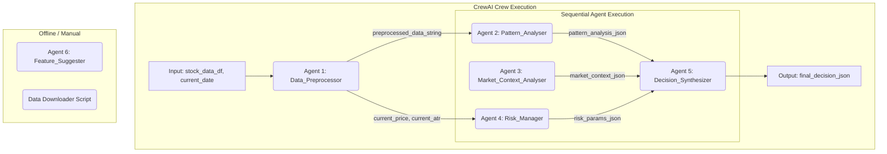
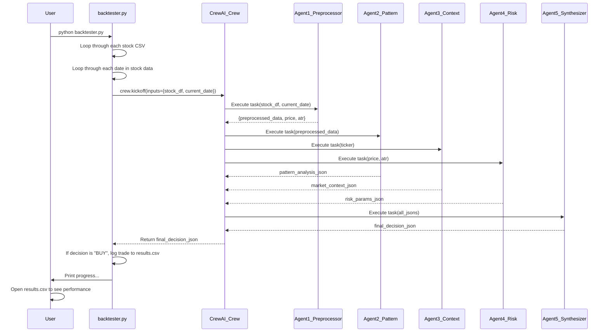

## Architecture Document: Project "Emergent Alpha"

*   **Version:** 1.0
*   **Date:** October 26, 2023
*   **Author:** System AI
*   **Status:** For Implementation

### 1. Philosophy & Guiding Principles

This system is an experiment in rapid, pragmatic development. Our goal is not to build a perfect, all-encompassing trading behemoth. It is to build a functional, testable prototype in **two days**. Every decision must serve this goal.

1.  **Simplicity Over Complexity:** We will use the simplest tools that get the job done. If a Python script with `pandas` can do it, we don't need a database. If a CSV file works, we don't need a message queue.
2.  **Speed of Iteration:** The architecture must allow for fast changes. The agentic design is key. Swapping a prompt or a Python function should be trivial. We are building for experimentation, not for production scale.
3.  **Local First:** The entire system—data, code, and orchestration—will run locally. No cloud dependencies, no complex deployments. This eliminates entire categories of problems and keeps us focused on the core logic.
4.  **Text is the Universal Interface:** We will lean heavily on structured text (specifically JSON) as the data contract between components. LLMs are good at text; Python is good at text. This is our common ground.
5.  **No Magic:** We will avoid frameworks or libraries that hide too much logic. We need to know exactly what is happening at each step. CrewAI provides a transparent, code-first approach where the orchestration logic is explicit Python code, not hidden behind visual abstractions.

### 2. Technology Stack

This is not a list of preferences; it is a strict definition of our toolkit. Adding anything to this list requires justification for why a simpler, existing tool cannot do the job.

#### **Chosen Stack (The "Yes" List)**

| Technology      | Purpose                                                              | Rationale                                                                                             |
| --------------- | -------------------------------------------------------------------- | ----------------------------------------------------------------------------------------------------- |
| **Python 3.10+**  | The core programming language for all custom logic.                  | Ubiquitous, excellent data science ecosystem, simple syntax. The default choice.                      |
| **Pandas**      | Data manipulation and feature calculation.                           | The industry standard for handling tabular data like OHLCV. Fast and reliable for our needs.          |
| **yfinance**    | Downloading historical stock data.                                   | Simple, free, and directly interfaces with Yahoo Finance. Good enough for historical backtesting.     |
| **CrewAI**    | Multi-agent orchestration and workflow coordination.                | A lightweight, code-first framework for agent coordination. No visual complexity, pure Python control with transparent execution flow. |
| **OpenAI API (or equivalent large-context LLM)** | The core pattern recognition engine. | We need a model capable of reasoning over numerical sequences and adhering to strict JSON output formats. CrewAI integrates seamlessly with various LLM providers. |
| **CSV Files**   | Data storage for historical OHLCV and backtest results.              | The simplest possible persistent storage. Human-readable, easy to manipulate with `pandas`, no server required. |

#### **Explicitly Excluded (The "No" List)**

| Technology / Pattern        | Reason for Exclusion                                                                                                                            |
| --------------------------- | ----------------------------------------------------------------------------------------------------------------------------------------------- |
| **Complex ML Frameworks**   | (e.g., TensorFlow, PyTorch, LSTMs). The PRD explicitly forbids this. We are testing an LLM-as-analyst approach, not a traditional ML model.         |
| **Databases**               | (e.g., SQL, NoSQL). Overkill. Our data is read-only during a backtest run. A folder of CSVs is a perfectly functional database for this project. |
| **Real-time Data Feeds**    | (e.g., Websockets, Kafka). Out of scope. We are building a backtesting system, not a live trading bot. This adds immense complexity for zero gain. |
| **Cloud Services / Docker** | (e.g., AWS, GCP, Docker). Unnecessary deployment complexity. The goal is a working prototype, not a scalable production service. Run it locally. |
| **Visual Workflow Builders** | (e.g., Langflow, n8n). While useful, they add a layer of abstraction. For rapid prototyping, direct Python code gives us more control and transparency. |
| **Automated Feature Eng.**  | (e.g., `featuretools`). The PRD specifies a meta-agent for *suggesting* features. The actual engineering is a manual, deliberate process for v1.1. |

### 3. System Architecture & Data Flow

The system is composed of two primary phases:
1.  **Offline Data Preparation:** A one-time script to download all necessary historical data.
2.  **Online Analysis Pipeline:** The core agentic workflow, orchestrated by CrewAI, which is called repeatedly by the backtester script.

#### **Component Interaction Diagram**

This diagram shows the static components and their connections as they will be built in CrewAI.



#### **Execution Sequence & Data Flow Diagram**

This diagram shows the step-by-step execution flow, including the backtester.



### 4. Data Models & Schemas

Clear data contracts are non-negotiable. Each component's input and output must conform to these schemas.

| Component               | Input(s)  -| Output(s) -|
| `Data_Preprocessor`       | `stock_dataframe`: pandas DataFrame<br>`current_date`: string (YYYY-MM-DD) - | `preprocessed_data_string`: string<br>`current_price`: float<br>`current_atr`: float - |
| `Pattern_Analyser`        | `preprocessed_data_string`: string - | `output_json`: string containing `{"pattern_description": string, "pattern_strength_score": float, "rationale": string}`- |
| `Market_Context_Analyser` | `stock_ticker`: string - | `output_json`: string containing `{"sector_trend": string, "vix_analysis": string}`- |
| `Risk_Manager`            | `current_price`: float<br>`current_atr`: float- | `output_json`: string containing `{"stop_loss": float, "take_profit": float}`- |
| `Decision_Synthesizer`    | `pattern_analysis_json`: string<br>`market_context_json`: string<br>`risk_params_json`: string - | `output_json`: string containing `{"decision": "BUY" or "PASS", "confidence_score": float (optional), "summary_rationale": string}`- |


### 5. Prompt Engineering & Construction

The prompts are not just questions; they are programs for the LLM. They must be engineered with precision.

**General Principles:**
1.  **Role-Playing:** The first line of every prompt assigns a role to the LLM (e.g., "You are an expert quantitative analyst..."). This primes the model to use the correct context and tone.
2.  **Strict Instructions:** Use numbered lists and bold text to provide clear, unambiguous instructions. The LLM should know exactly what to do and what to avoid.
3.  **Structured Output (JSON):** This is the most critical principle. Every LLM call that feeds into another component **MUST** output a valid JSON. This makes the output machine-readable and reliable, preventing parsing errors. We will use Langflow's built-in JSON parsing where possible.
4.  **Context, not Conversation:** We provide all necessary data within the prompt itself. The LLM calls are stateless. We are not having a conversation; we are executing a function.
5.  **Jargon Control:** The `Pattern_Analyser` prompt explicitly forbids technical indicator names. This is the core of the "emergent" philosophy. We want the LLM to describe what it sees, not just label it with a pre-learned term.

**Detailed Prompts:**
*(The prompts from the PRD are well-defined and will be used as-is. They are listed here for completeness.)*

*   **`Pattern_Analyser` Prompt:** See PRD Section 5.
*   **`Market_Context_Analyser` Prompt:** See PRD Section 5.
*   **`Decision_Synthesizer` Prompt:** See PRD Section 5.
*   **`Feature_Suggester` Prompt:** See PRD Section 5.

### 6. Backtesting Framework

The backtester is a simple, robust Python script (`backtester.py`). It is the engine that validates our entire system.

**Project File Structure:**

```
emergent-alpha/
├── data/
│   ├── NIFTY200_list.csv
│   └── ohlcv/
│       ├── RELIANCE.NS.csv
│       ├── TCS.NS.csv
│       └── ... (all other stock CSVs)
├── src/
│   ├── agents/
│   │   ├── data_preprocessor.py
│   │   ├── pattern_analyser.py
│   │   ├── market_context_analyser.py
│   │   ├── risk_manager.py
│   │   └── decision_synthesizer.py
│   ├── tools/
│   │   ├── data_tools.py
│   │   └── market_tools.py
│   └── crew.py  # Main CrewAI crew definition
├── results/
│   └── backtest_results_YYYYMMDD_HHMM.csv
├── backtester.py
├── download_data.py
└── requirements.txt
```

**`backtester.py` Execution Logic:**

1.  **Initialization:**
    *   Load the list of stock tickers from `NIFTY200_list.csv`.
    *   Initialize the CrewAI crew with all agents and their tasks.
    *   Create an empty list to hold trade results.
2.  **Outer Loop (Stocks):**
    *   For each `ticker` in the list:
        *   Load the corresponding `data/ohlcv/{ticker}.csv` into a pandas DataFrame.
3.  **Inner Loop (Time):**
    *   For each `date` in the DataFrame's index (starting from day 61 to avoid lookback errors):
        *   Slice the DataFrame to get the required 240 days of data (60 for analysis + 200 for long-term MA + 20 for forward return check).
        *   Prepare the inputs for the CrewAI crew: the sliced DataFrame and the `current_date`.
        *   **Crew Execution:** Call `crew.kickoff(inputs={...})` to execute the agent workflow. Use a `try-except` block to handle potential execution errors gracefully.
        *   **Process Response:**
            *   Parse the JSON response from the crew execution.
            *   If `response['decision'] == 'BUY'`:
                *   Calculate the actual 20-day forward return from the data.
                *   Determine if the trade would have hit the `stop_loss` or `take_profit` within the 20 days.
                *   Create a dictionary for the trade log: `{date, ticker, entry_price, stop_loss, take_profit, 20d_return, outcome, rationale}`.
                *   Append this dictionary to the results list.
4.  **Finalization:**
    *   After all loops complete, convert the results list into a pandas DataFrame.
    *   Save the DataFrame to `results/backtest_results_YYYYMMDD_HHMM.csv`.
    *   Print a summary of the performance metrics (Win Rate, Profit Factor, Total Trades).

### 7. Implementation Plan Adherence

The 2-day sprint plan from the PRD is aggressive but achievable with this architecture.

*   **Day 1:** Focus on developing individual CrewAI agents and their tools (`download_data.py`, agent classes, tool functions). Each agent can be written and unit-tested independently. The prompts can be finalized as agent backstories and goals.
*   **Day 2:** The primary task is assembling the crew in `crew.py`, defining tasks and their dependencies, and ensuring proper data flow between agents. The `backtester.py` script is the final piece, tying everything together by calling the crew execution method.

This plan minimizes dependencies and allows for parallel work. The individual agents are developed independently of the final orchestration, which is a simple assembly task on Day 2.

### 8. MVP: exact deliverables (minimal, actionable)

Keep this extremely short — what must exist to call the project an MVP:

- Files:
    - `data/ohlcv/{TICKER}.csv` (one sample: `RELIANCE.NS.sample.csv`).
    - `src/data_preprocessor.py` — reads CSV / yfinance, returns normalized 40-day window + price + ATR.
    - `src/risk_manager.py` — function: stop_loss = price - 2*ATR, take_profit = price + 4*ATR.
    - `src/pattern_scorer.py` — deterministic scorer (no-LLM) that returns score 0–10.
    - `backtester.py` — single-ticker runner that writes `results.csv` with trades and 20d outcomes.
    - `analysis/analyze_results.py` — prints win rate and profit factor.

- Minimal tests: unit tests for `data_preprocessor` and `risk_manager` (happy path + ATR=0).

- Acceptance criteria:
    - `python backtester.py --ticker RELIANCE.NS.sample` completes and produces `results.csv`.
    - `analyze_results.py results.csv` prints Win Rate and Profit Factor.

If these exist and run locally without CrewAI or LLM credentials, we have an MVP. Anything else is optional for v1.0.